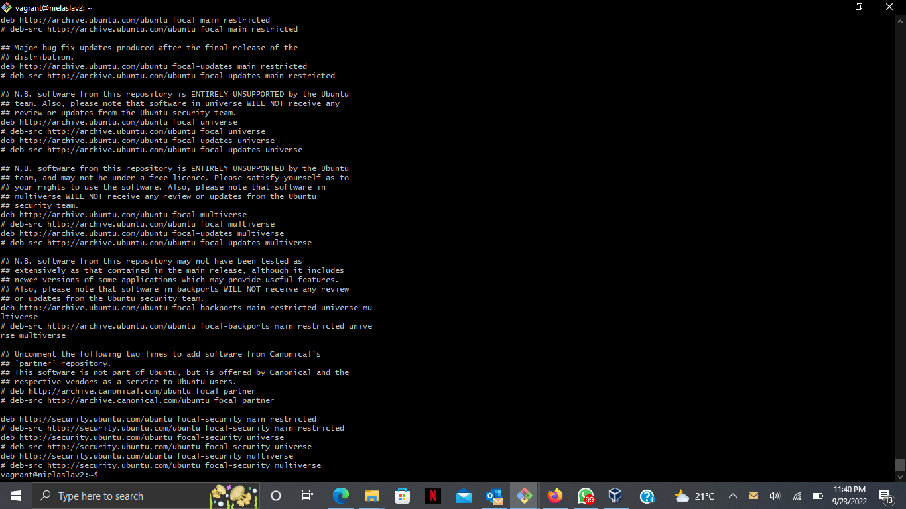
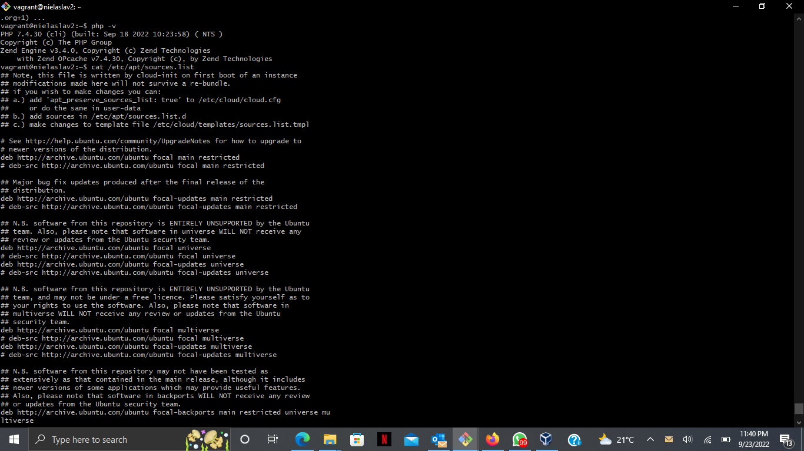

## INSTALLING PHP7.4
### These are the steps taken to install php7.4. 
  
STEPS:
    <ol>
        <li> Ran the command "sudo apt-get install software-properties-common apt-transport-https -y"     </li>
        <li> Ran command "sudo add-apt-repository ppa:ondrej/php -y"     </li>
        <li> Ran "sudo apt-get update -y"  </li>  
        <li> Ran "sudo apt-get upgrade -y"  </li>  
        <li> Ran "sudo apt-get install -y php7.4-common" to install the common version    </li>
    </ol>
 

 Below are the screenshots 

<ul> <li> /etc/apt/sources.list </li> </ul>

 

<ul> <li> /php -v </li> </ul> 

 

 That is the end of exercise four. THE END.
