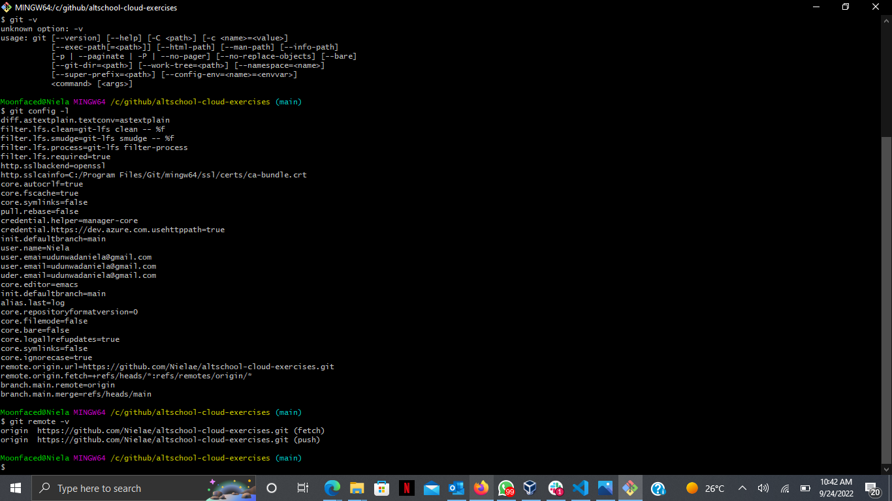
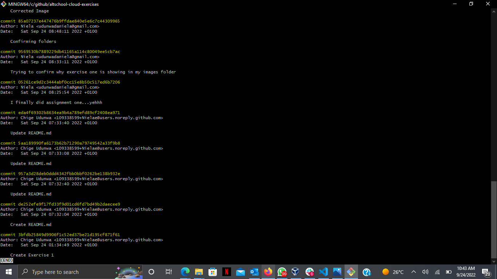
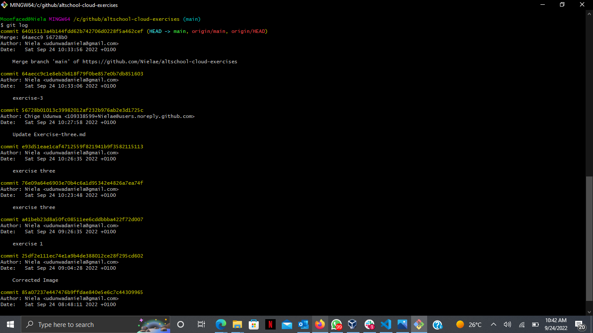

## CLONING MY REPO TO MY LOCAL SYSTEM
### These are the steps taken to clone from github 
  
STEPS:
    <ol>
        <li> I already have a github account, so there was no need to install and create a new account  </li>
        <li> Created a folder on my local which i would be using for anything git, also created necessary sub folders within it     </li>
        <li> Opened my command line and cd'd into the github folder   </li>
        <li> Went to my browser, then logged into the github web platform   </li>  
         <li> Already had my altschool exercise repo   </li> 
        <li> Well, it was still empty as i had not pushed my assignments sooooo...... created the first file and named it exercise one. so i have something.  </li>  
         <li> Clicked on the code dropdown, it brought the https, ssh and cli links  </li> 
         <li> Copied the https link   </li>
         <li> Navigated back to my command and ran the command "git clone "the copied link"   </li>
        <li> This prompted a security box that had me log in to confirm it was not a breach    </li>
        <li> Clone successful, the repo was created in my github folder on my local </li>
        <li> cd'd into the repo and ran the exercise commands   </li>
    </ol>
 

 Below are the screenshots 

<ul> <li> git config -l, git remote -v </li> </ul>

 

<ul> <li> git log1 </li> </ul>

 

<ul> <li> git log2 </li> </ul>

 That is the end of exercise five. THE END.