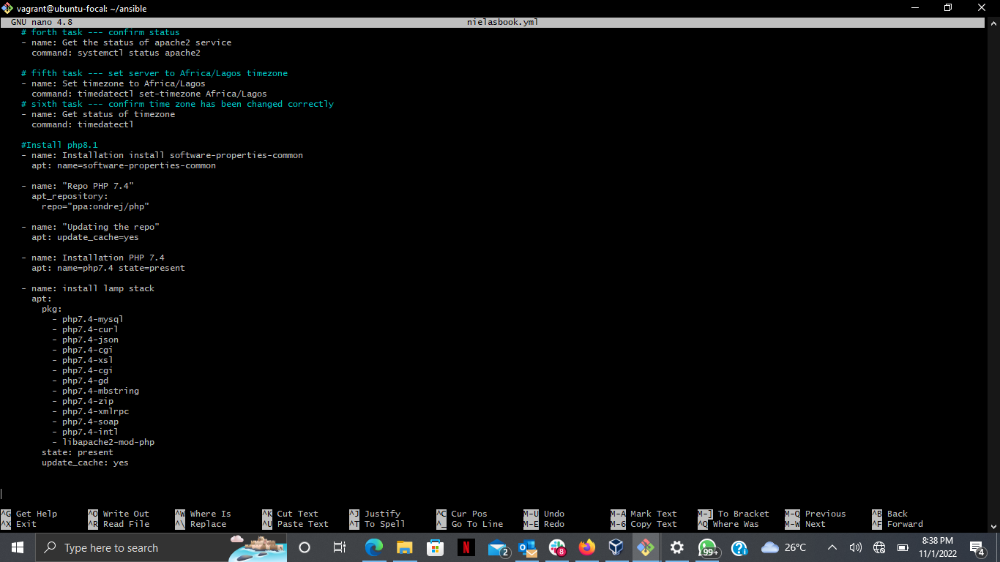

<ul> <li> Ansible playbook1 </li> </ul>

 

<ul> <li> Ansible playbook 2 </li> </ul>

 

<ul> <li>ansible output </li> </ul>

 

ul> <li>Apache output </li> </ul>

 That is the end of exercise eight. THE END.