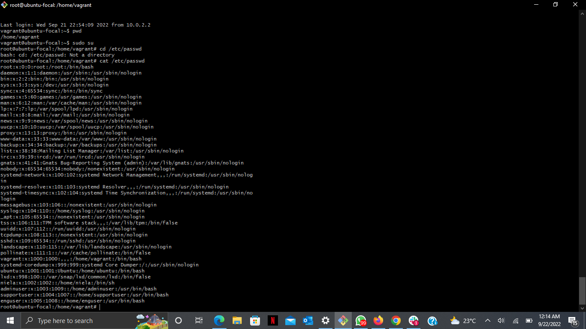
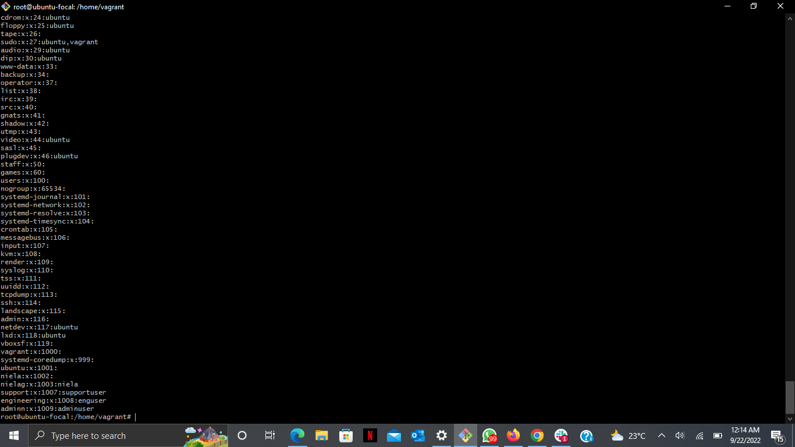
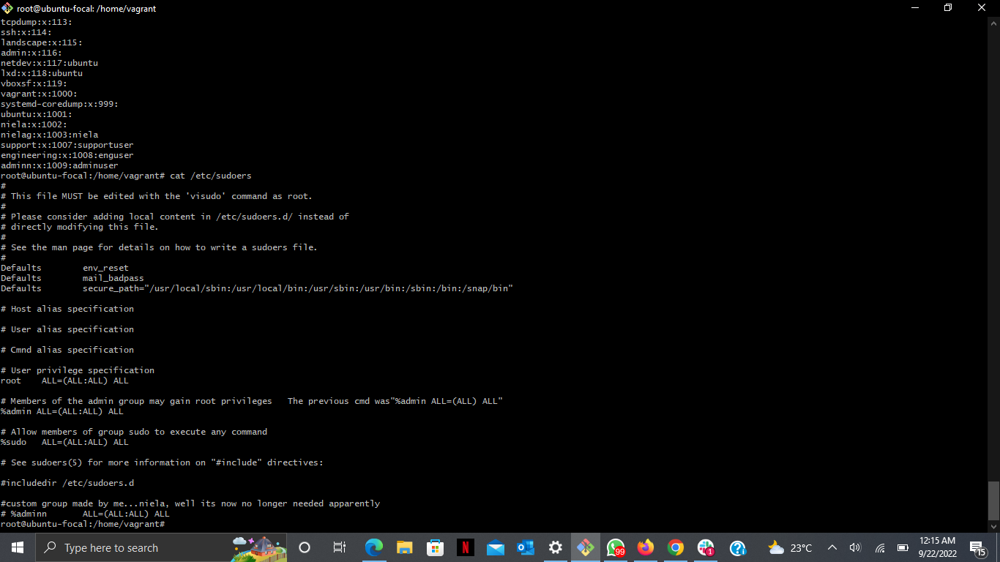

## USERS, GROUPS, SSH KEY
### These are the steps taken to create users, create groups and add users to the groups while genearating SSH key for the admin group. 
  
STEPS:
    <ol>
        <li> Created users "adminuser", "supportuser", "enguser" using the command "useradd -m username"     </li>
        <li> Created groups "admin" "support" "engineering" using the command "groupadd gropname"     </li>
        <li> added each user to their corresponding groups using the command "usermod -G groupname username"  </li>    
        <li>Generated key for the "adminn group" with the command "SSH -key gen"    </li>
    </ol>
 

 Below are each of the screenshots 

 

 

 

 That is the end of exercise three. THE END.
