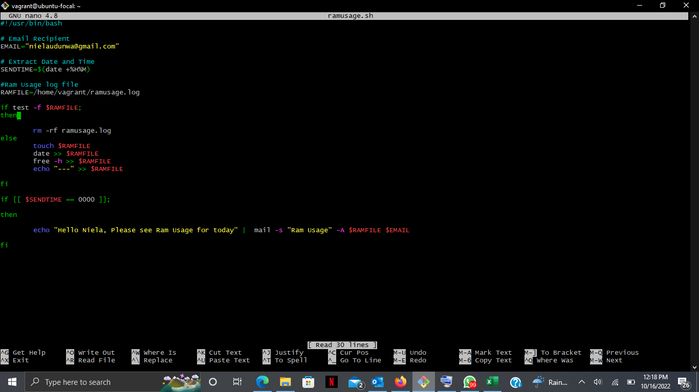
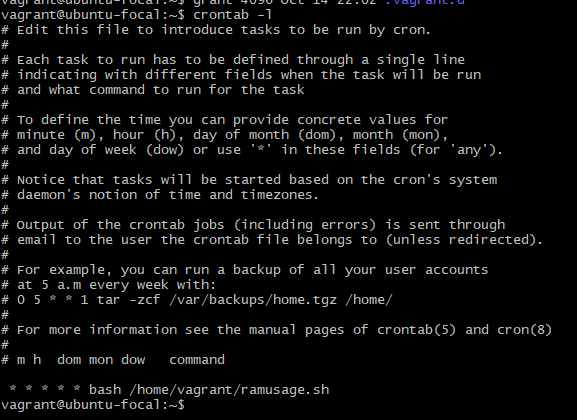
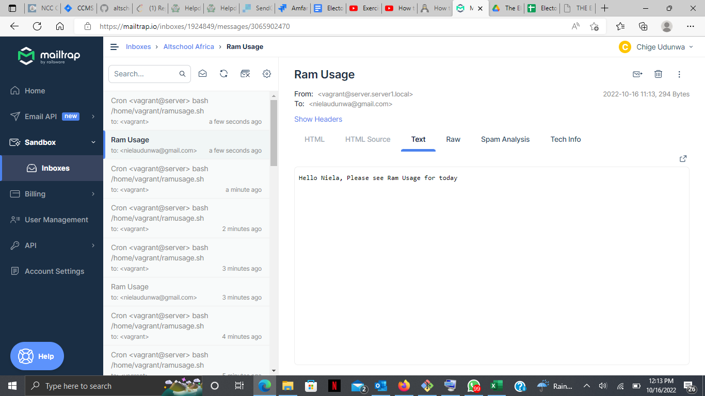

## SMTP CRIPT, CRONJOB AND SAMPLE EMAIL
### These are the steps ............. Not today, today I just can't. 
  
STEPS:
    <ol>
        <li> I guess i do not have much of a choice     </li>
        <li> Well, I cannot remember the steps i took.      </li>
        <li> Pheeeewww  </li>    
        <li>Hopefully, I will get to edit this steps with the real steps.    </li>
    </ol>
 

 Below are each of the screenshots 

<ul> <li> SMTP Script </li> </ul>

 

<ul> <li> /etc/group </li> </ul>

 

<ul> <li>Sample Email </li> </ul>

 

 That is the end of exercise three. THE END.